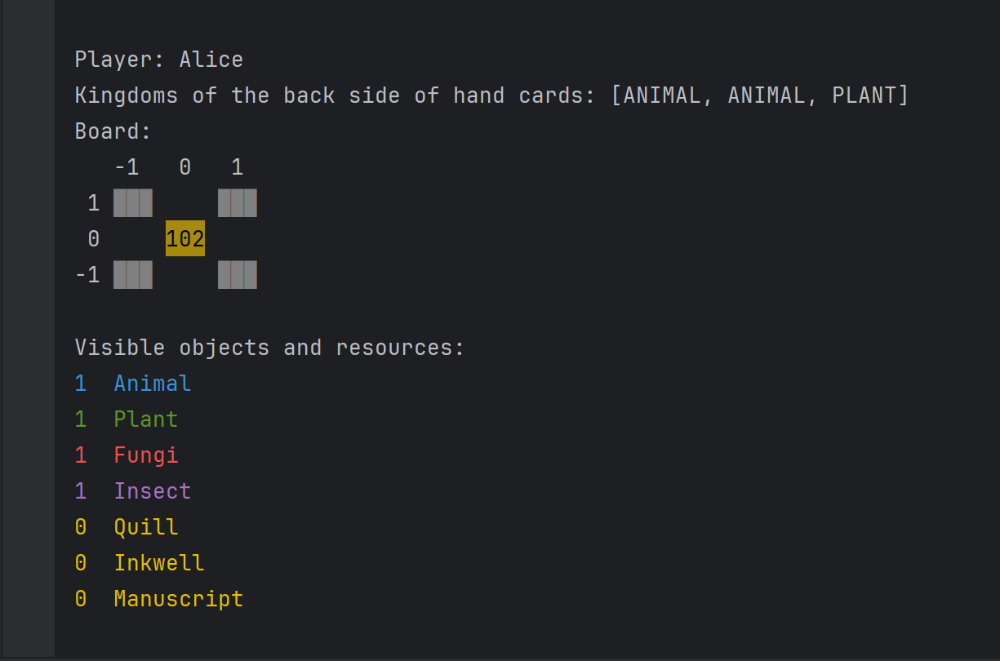

# SOFTWARE ENGINEER PROJECT - 2024
<table>
<tr>
<td width="185">

## Team
<a href="https://github.com/lsy0000000">Valeria Lu</a> </br>
<a href="https://github.com/Jiang00001">Elena Jiang</a> </br>
<a href="https://github.com/nourmh21">Nourhane M'hadhbi</a></br>
<a href="https://github.com/ElenaLin31">Elena Lin</a></br>
<a href="https://github.com/joshuagottardo-polimi">Joshua Gottardo</a></br>
<br>
<br>
</td>

<td>

</a>
</td>
</tr>
</table>

## Implemented functionalities 

| Functionality  | Status |
|----------------|:------:|
| Basic rules    |   ✅    |
| Complete rules |   ✅    | 
| Socket         |   ✅    | 
| RMI            |   ✅    |
| TUI            |   ✅    | 
| GUI            |   ✅    |
| Multiple games |   ✅    | 
| Resilience     |   ❌    |
| Persistence    |   ❌    |
| Chat           |   ✅    |

## Launch

The server app can be run with the following command:
```shell
java -jar codex_naturalis_server.jar ip_address port_number   
```
Note: The party running the server application must verify the available port numbers themselves.

The client app can be run one of following command: <br>
TUI
```shell
java -jar codex_naturalis_client.jar --tui
```
GUI
```shell
java -jar codex_naturalis_client.jar    
```

## Game scenes
* TUI
<table>
<td></td>
<td></td>
</table>

* GUI
<table>
<td></td>
<td></td>
<td rowspan="2"></td>
<tr >
<td></td>
<td></td>
</tr>
</table>


## License

This project contains copyrighted graphical assets which is property of <a href = "https://www.craniocreations.it/prodotto/codex-naturalis">Cranio Creations srl</a>.
